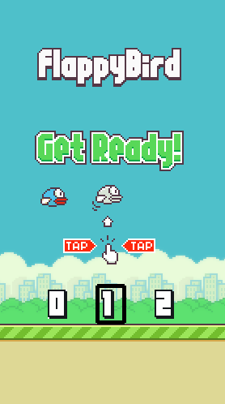

# Flappy Bird

An exercise in recreating Flappy Bird, using PyGame. Aggressively commented for
my own personal benefit as I learn the ins and outs of using PyGame!

## To play
1. Clone the repository: https://github.com/amanda321/flappy-bird
2. In your console: python main.py
3. Select your level using the left/right arrow keys. Then press space bar to start.
3. Press the space bar to tell your bird to flap its wings. Every single pipe pair
you pass through gives you an extra point!

## Prerequisites
Note that other versions of the below packages/libraries may work, I'm just listing the configuration that worked on my computer.
- Python 3.6.4
- pygame 1.9.3

## Some extra things I added
- Easy/Medium/Hard level of the games (by adjusting the gaps between the pipes) 
Here's an example of the game in action:

## Credit
Thanks to sourabhv for the sprite images!
https://github.com/sourabhv/FlappyBirdClone